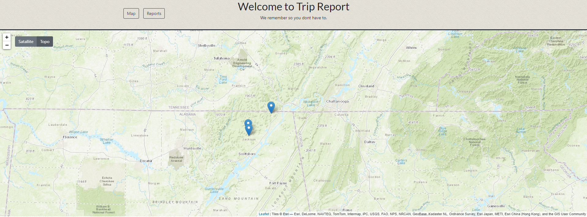
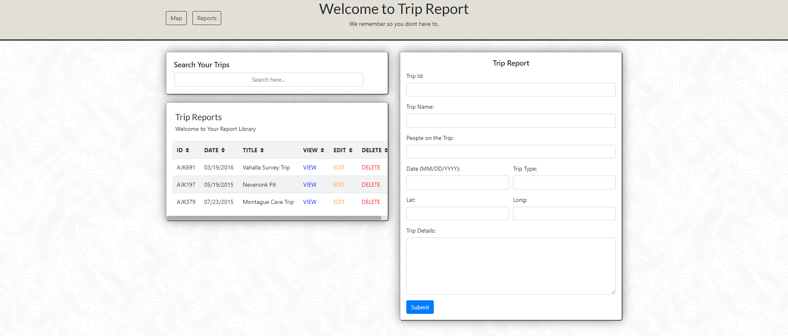

# trip-report

## User Story
As a user, I want to be able to keep a record of my trips for reference later

## Description
A MERN application to track outdoor excursions 

## Installation
Clone to your local machine and open in your favorite code editor.  Open a bash terminal and do an "npm install" to get the node modules.  Then type "npm start" to run the application.

## Technologies Utilized
Node, React, Express, Mongo, leaflet, react-bootstrap

## Screen Shots
### Map Screen

On the map screen your trips will apear as pins on the map.  you can click on the pins to see your report.  you also have the option to switch from topo (the default) and satilite view.

### Report Screen

The report screen gives you the option to start a new report or edit an existing one.  you also have the option to sort by the values by clicking the arrows by the column titles or you can search by typing in the search field provided.

## Links
[Live App](https://tripreport.herokuapp.com/)

## Contributing
Pull requests are welcome. For major changes, please open an issue first to discuss what you would like to change.
Please make sure to update tests as appropriate.

## License
[MIT]
MIT License

Permission is hereby granted, free of charge, to any person obtaining a copy
of this software and associated documentation files (the "Software"), to deal
in the Software without restriction, including without limitation the rights
to use, copy, modify, merge, publish, distribute, sublicense, and/or sell
copies of the Software, and to permit persons to whom the Software is
furnished to do so, subject to the following conditions:

The above copyright notice and this permission notice shall be included in all
copies or substantial portions of the Software.

THE SOFTWARE IS PROVIDED "AS IS", WITHOUT WARRANTY OF ANY KIND, EXPRESS OR
IMPLIED, INCLUDING BUT NOT LIMITED TO THE WARRANTIES OF MERCHANTABILITY,
FITNESS FOR A PARTICULAR PURPOSE AND NONINFRINGEMENT. IN NO EVENT SHALL THE
AUTHORS OR COPYRIGHT HOLDERS BE LIABLE FOR ANY CLAIM, DAMAGES OR OTHER
LIABILITY, WHETHER IN AN ACTION OF CONTRACT, TORT OR OTHERWISE, ARISING FROM,
OUT OF OR IN CONNECTION WITH THE SOFTWARE OR THE USE OR OTHER DEALINGS IN THE
SOFTWARE.

- - - - -
